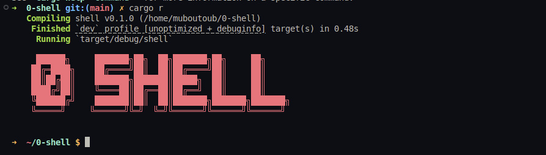

# 0-Shell

A minimalist Unix-like shell implemented in Rust, designed to execute core Unix commands using system calls without relying on external binaries or built-in shells like `bash` or `sh`. Inspired by tools like BusyBox, 0-Shell is built for an embedded Linux environment, emphasizing lightweight design, safety, and direct interaction with Unix system APIs.

## Table of Contents
- [Overview](#overview)
- [Features](#features)
- [Requirements](#requirements)
- [Installation](#installation)
- [Usage](#usage)
- [Supported Commands](#supported-commands)
- [Constraints](#constraints)
- [Contributing](#contributing)
- [License](#license)

## Overview
0-Shell is a system-level project that introduces developers to Unix system programming through Rust's safe and efficient abstractions. It focuses on core shell functionalities, including process creation, command execution, and file system interaction, without depending on external utilities. The shell is designed to mimic essential Unix shell behaviors while adhering to good coding practices and robust error handling.

## Features
- Displays a prompt in the format `~/path/to/current/directory $` for user input
- Parses and executes basic Unix commands
- Maintains a command history accessible via the `history` command
- Clears the terminal screen with the `clear` command
- Handles `Ctrl+D` (EOF) and `Ctrl+C` gracefully to exit or interrupt without crashing
- Implements commands using Rust and system calls, avoiding external binaries
- Provides clear error messages for unrecognized commands
- Supports basic command-line arguments for specific commands (e.g., `ls -l`, `ls -a`, `-F`)

## Requirements
- Rust (stable, version 1.82.0 or higher recommended)
- Cargo (Rust's package manager)
- A Unix-like operating system (Linux recommended)
- Basic familiarity with Unix commands and Rust programming

## Installation
1. **Clone the Repository**:
   ```bash
   git clone https://github.com/yourusername/0-shell.git
   cd 0-shell
   ```

2. **Build the Project**:
   ```bash
   cargo build
   ```

## Usage
1. Launch the shell by running:
   ```bash
   cargo run
   ```

2. At the `~/path/to/current/directory $` prompt, enter a command (e.g., `ls`, `cd dir_name`, `echo hello`).
3. Use `Ctrl+D` or type `exit` to quit the shell, or `Ctrl+C` to interrupt the current operation without crashing.
4. If an unrecognized command is entered, the shell will display:
   ```
   Command '<name>' not found
   ```

## Supported Commands
The following commands are implemented from scratch using Rust and system calls:

- `echo`: Prints text to the console
- `cd`: Changes the current working directory
- `ls`: Lists directory contents (supports `-l`, `-a`, `-F` flags)
- `pwd`: Prints the current working directory
- `cat`: Displays file contents
- `cp`: Copies files
- `rm`: Removes files (supports `-r` for recursive deletion)
- `mv`: Moves or renames files
- `mkdir`: Creates directories
- `clear`: Clears the terminal screen
- `history`: Displays the history of entered commands
- `exit`: Exits the shell



## Constraints
- Supports only basic command syntax (no piping, redirection, or globbing or ...)
- Commands are implemented without relying on external binaries
- Shell behavior aligns with Unix conventions
- Code adheres to Rust's safety guarantees and best practices
